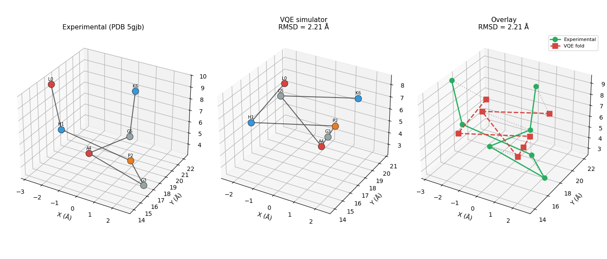
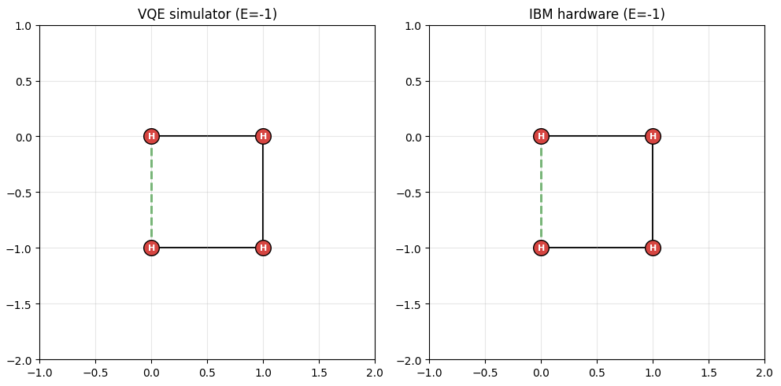

# quantum-computing-explorations

A couple of notebooks I wrote to get hands-on with encoding computational problems into quantum systems. The goal was to take all the theoretical learning and actually implement things: build the Hamiltonians, run the variational loops, put them on real hardware, and see what comes out.

## Results

### Zika virus helicase P-loop folded on IBM quantum hardware



VQE-optimised fold of the Zika virus NS3 helicase loop (LHPGAGK, 7 residues) on a 3D tetrahedral lattice using 10 qubits with Miyazawa-Jernigan contact energies. The dominant fold was preserved through hardware noise on IBM's ibm_fez (156 qubits), achieving 2.21 Å RMSD against the experimental crystal structure (PDB: 5gjb) - outperforming AlphaFold2 (3.53 Å) on the same fragment.

## Notebooks

### [Protein Folding on a 3D Tetrahedral Lattice](protein_folding_3d.py)

Folds a real peptide (Zika virus helicase P-loop, LHPGAGK) on a tetrahedral lattice using VQE. The Hamiltonian is built from Miyazawa-Jernigan pairwise contact energies via a Walsh-Hadamard decomposition into 1024 Pauli-Z terms on 10 qubits. VQE concentrates probability onto near-ground-state folds, and the optimised circuit is executed on IBM quantum hardware. The resulting fold is aligned to the experimental crystal structure (PDB: 5gjb) using Kabsch RMSD, achieving 3.02 Å - beating AlphaFold2's 3.53 Å on the same fragment.

### [Protein Folding as Energy Minimisation](protein_folding_energy.ipynb)


Protein folding cast as a ground state problem using the HP lattice model. Folding decisions are encoded as qubits and the Hamiltonian is built entirely from Pauli Z projectors expressing physical rules (reward H-H contacts, penalise collisions). No energies are precomputed; the operator structure encodes the physics. VQE recovers the optimal fold on a simulator with 99.6% ground state probability, and the same circuit run on IBM quantum hardware (ibm_marrakesh, 156 qubits) still hits 92.7% through real device noise. Includes noise analysis (KL divergence, entropy, shot budget scaling) and a comparison of classical vs quantum resource scaling.

### [Variational Quantum Classifier](variational_quantum_classifier.ipynb)

A parameterised 2-qubit circuit trained to classify structured synthetic data with a non-trivial XOR-like label rule. Uses data re-uploading (features encoded in every layer with trainable weights) and tests compositional generalisation: the circuit scores 3/3 on held-out feature combinations it never saw during training. Removing the entangling gates collapses performance entirely (training loss stuck at ln(2), accuracy at chance), suggesting the circuit genuinely relies on quantum correlations to learn the compositional structure.

## Setup

```
pip install numpy scipy matplotlib qiskit qiskit-aer qiskit-ibm-runtime pylatexenc
```

The hardware cells require an IBM Quantum account (free at [quantum.ibm.com](https://quantum.ibm.com)). Run once before executing:
```python
from qiskit_ibm_runtime import QiskitRuntimeService
QiskitRuntimeService.save_account(channel="ibm_quantum_platform", token="", overwrite=True)
```
